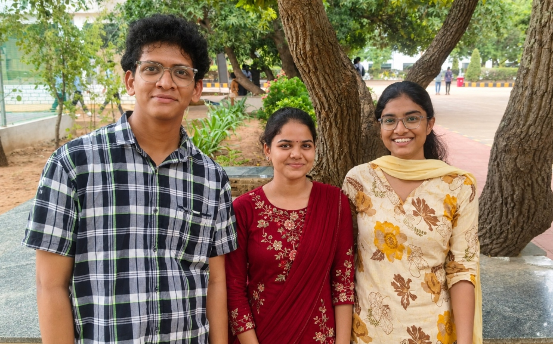
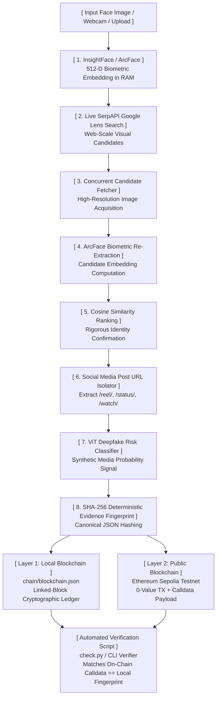

# 🛡️ FaceID

> **End-to-End Biometric Provenance, OSINT Social Attribution & Dual-Layer Blockchain Forensic Pipeline**

[](https://www.python.org/)
[](https://github.com/deepinsight/insightface)
[](https://huggingface.co/prithivMLmods/Deep-Fake-Detector-v2-Model)
[](https://serpapi.com/)
[](https://sepolia.etherscan.io/)
[](LICENSE)

---

## 👥 Engineering Group: Team Vision Quest

<div align="center">



### **Team Vision Quest**
*Digital Identity Provenance, Forensic Computer Vision & Decentralized Cryptography*

| Member Name | Engineering Role | Core Focus Areas |
| :--- | :--- | :--- |
| **Rishik Velagapudi** | Lead Architecture & Biometrics | Pipeline Orchestration, 512-D ArcFace Biometrics, Cosine Re-Verification |
| **Byula Sonti** | Blockchain & Cryptographic Integrity | Dual-Layer Ledger Design, Sepolia Calldata Proof-of-Existence, Verification Audits |
| **Jahnavi Sirikonda** | OSINT Reconnaissance & Deepfake AI | Google Lens Visual Search, Social Media Post Isolator, ViT Deepfake Detection |

</div>

---

## 📋 Executive Summary

**`FaceID`** is an enterprise-grade forensic investigation pipeline engineered to combat **digital impersonation**, **unauthorized visual replication**, and **synthetic media proliferation (deepfakes)**.

Standard reverse-image engines return link lists based purely on text or page popularity, frequently providing dead portal links, duplicate SEO mirrors, or inaccurate attributions. `FaceID` overcomes these limitations by combining:
1. **Biometric facial topology** (invariant 512-D ArcFace vectors computed strictly in volatile RAM).
2. **Live web-scale visual OSINT** (Google Lens via SerpAPI).
3. **Automated biometric re-verification** (cosine similarity against downloaded candidates).
4. **Actionable social media post extraction** (isolating specific posts like `/reel/`, `/status/`, `/watch`).
5. **Transformer-based synthetic media risk scoring** (ViT Deepfake Detection).
6. **Deterministic cryptographic evidence fingerprinting** (SHA-256 canonical hashing).
7. **Dual-layer blockchain anchoring** (local instant cryptographic block ledger + public Ethereum Sepolia PoE via calldata).

---

## 🏛️ System Architecture & Workflow



### High-Fidelity Forensic Workflow

```text
┌────────────────────────────────────────────────────────────────────────┐
│                        INPUT SOURCE IMAGE / WEBCAM                     │
└───────────────────────────────────┬────────────────────────────────────┘
                                    │
                                    ▼
┌────────────────────────────────────────────────────────────────────────┐
│   1. BIOMETRIC TOPOLOGY & EMBEDDING (InsightFace ArcFace buffalo_s)    │
│      Extracts 512-D invariant vector; holds strictly in volatile RAM   │
└───────────────────────────────────┬────────────────────────────────────┘
                                    │
                                    ▼
┌────────────────────────────────────────────────────────────────────────┐
│   2. REVERSE OSINT ATTRIBUTION (Google Lens Visual Engine via SerpAPI) │
│      Fetches global visual matches and publisher metadata              │
└───────────────────────────────────┬────────────────────────────────────┘
                                    │
                                    ▼
┌────────────────────────────────────────────────────────────────────────┐
│   3. CONCURRENT CANDIDATE RE-VERIFICATION (ThreadPoolExecutor)         │
│      Downloads media; computes exact cosine similarity + pHash         │
└───────────────────────────────────┬────────────────────────────────────┘
                                    │
                                    ▼
┌────────────────────────────────────────────────────────────────────────┐
│   4. ACTIONABLE SOCIAL MEDIA ATTRIBUTION                               │
│      Filters generic URLs; surfaces specific posts (/reel/, /status/)  │
└───────────────────────────────────┬────────────────────────────────────┘
                                    │
                                    ▼
┌────────────────────────────────────────────────────────────────────────┐
│   5. VISION TRANSFORMER (ViT) DEEPFAKE RISK ASSESSMENT                 │
│      Computes probability of synthetic media manipulation              │
└───────────────────────────────────┬────────────────────────────────────┘
                                    │
                                    ▼
┌────────────────────────────────────────────────────────────────────────┐
│   6. CANONICAL SHA-256 EVIDENCE FINGERPRINTING                         │
│      Deterministic JSON hashing of all metadata and verification steps │
└───────────────────────────────────┬────────────────────────────────────┘
                                    │
            ┌───────────────────────┴───────────────────────┐
            ▼                                               ▼
┌───────────────────────────────┐   ┌────────────────────────────────────┐
│  LAYER 1: LOCAL LEDGER        │   │  LAYER 2: PUBLIC BLOCKCHAIN        │
│  chain/blockchain.json        │   │  Ethereum Sepolia Testnet          │
│  Hash-linked block ledger     │   │  EIP-1559 Calldata PoE Payload     │
└───────────────┬───────────────┘   └───────────────────┬────────────────┘
                │                                       │
                └───────────────────┬───────────────────┘
                                    │
                                    ▼
┌────────────────────────────────────────────────────────────────────────┐
│       CRYPTOGRAPHIC AUDIT & VERIFICATION (check.py / REST API)         │
│       Decodes Sepolia calldata; verifies byte-level mathematical match │
└────────────────────────────────────────────────────────────────────────┘
```

---

## ⛓️ Dual-Layer Blockchain Architecture

| Metric / Dimension | Layer 1: Local Ledger (`blockchain.json`) | Layer 2: Public Sepolia Testnet |
| :--- | :--- | :--- |
| **Latency** | Instant (< 5 ms) | 12–15 seconds (block confirmation) |
| **Network Cost** | Completely Zero Cost | Free Testnet ETH via Faucet |
| **Connectivity** | 100% Offline Capable | Requires Internet & RPC Node |
| **Consensus** | Single-Node Hash Integrity | Global Decentralized Proof-of-Stake |
| **Storage Method** | JSON Block Linked List | EIP-1559 Transaction Calldata |
| **Primary Use** | High-throughput internal auditing | External forensic proof & legal admissability |

### Why Calldata Instead of Smart Contracts?
Embedding the SHA-256 evidence fingerprint directly into Ethereum **transaction calldata**:
1. Eliminates complex smart contract deployment, proxy overhead, and upgradeability security risks.
2. Minimizes gas consumption to the standard 21,000 base gas plus calldata byte costs.
3. Provides an immutable, permanent decentralized Proof of Existence (PoE) that cannot be altered or paused by admin keys.

---

## ✨ Key Features & Capabilities

- **Real-Time Non-Hardcoded Search:** Directly interfaces with Google Lens via SerpAPI to discover real-world web appearances.
- **Independent Biometric Confirmation:** Never relies on search engine relevance; independently calculates 512-D ArcFace cosine similarity on all candidate photos.
- **Specific Social Post Isolation:** Distinguishes between dead portal roots (e.g. `instagram.com/explore`) and high-value actionable posts (e.g. `instagram.com/reel/<id>`, `x.com/<user>/status/<id>`).
- **AI Deepfake Detection:** Evaluates media through a Vision Transformer model (`prithivMLmods/Deep-Fake-Detector-v2-Model`) to identify AI-generated artifacts.
- **Evidence Image Export:** Download analyzed images annotated with ArcFace bounding boxes and facial landmark keypoints, or download individual candidate images.
- **Modern Retro-Terminal Web UI:** Includes drag-and-drop image upload, live webcam capture, dynamic similarity threshold controls, and comprehensive telemetry.
- **Dedicated Team Page:** View the official **Team Vision Quest** page at `/team` with team photograph and member profile cards.

---

## 🚀 Quickstart Guide

### 1. Prerequisites
- **Python 3.10 to 3.13**
- Internet connection (for initial model downloads: InsightFace `buffalo_s` and HuggingFace ViT weights)

### 2. Installation

Clone the repository:
```bash
git clone https://github.com/Rishikvelagapudi/FaceID.git
cd FaceID
```

Create and activate a virtual environment:
```powershell
# Windows PowerShell:
python -m venv venv
.\venv\Scripts\Activate.ps1

# Linux / macOS:
python3 -m venv venv
source venv/bin/activate
```

Install dependencies:
```bash
pip install -r requirements.txt
```

---

### 3. Environment Configuration

Copy the example environment file:
```bash
cp .env.example .env
```

Configure `.env`:
```ini
# Required: Google Lens Visual Search
SERPAPI_API_KEY=your_serpapi_key_here

# Optional: Public Ethereum Sepolia Testnet Anchoring
RPC_URL=https://ethereum-sepolia-rpc.publicnode.com
WALLET_ADDRESS=0x_your_wallet_address_here
PRIVATE_KEY=0x_your_private_key_here

# Pipeline Settings
SIMILARITY_THRESHOLD=0.45
PHASH_MAX_DISTANCE=12
MAX_SEARCH_RESULTS=10
REQUEST_TIMEOUT=8
USE_FREE_SCRAPER=false
```

> [!TIP]
> - Get a free SerpAPI key at [serpapi.com](https://serpapi.com/).
> - If Ethereum credentials are omitted, FaceID still executes fully, immutably logging evidence to Layer 1 local blockchain.

---

### 4. Running the Web Application

Launch the interactive web terminal:
```bash
python app.py --serve --port 8000
```

Open your browser:
- **Biometric Terminal:** [http://127.0.0.1:8000](http://127.0.0.1:8000)
- **About Team Vision Quest:** [http://127.0.0.1:8000/team](http://127.0.0.1:8000/team)
- **Interactive Swagger Docs:** [http://127.0.0.1:8000/docs](http://127.0.0.1:8000/docs)

---

### 5. Running via Command Line (CLI)

Execute forensic analysis directly on an image:
```bash
python app.py --image data/input/sample.jpg
```

**Common CLI Options:**
```bash
# Skip Sepolia blockchain submission
python app.py --image data/input/sample.jpg --no-blockchain

# Specify minimum cosine similarity threshold
python app.py --image data/input/sample.jpg --threshold 0.45

# Limit the number of candidates inspected
python app.py --image data/input/sample.jpg --top-k 5
```

---

### 6. Cryptographic Integrity Verification

To independently audit that an evidence hash stored on Sepolia matches the generated local output:

```bash
python check.py
```

Sample audit output:
```text
================================================================
FACEID FORENSIC INTEGRITY AUDIT
================================================================
Record Source : results/upload_f50d0a16_report.json
TX Hash       : 0x866a0e6987418ccb7cd9fb013694487e4dc3e7cd8dac70c68b91116bbdff42ac
On-chain hash : 53ddd440ff61a4c0f77bf90ff4aeb02b03f629ab4ec8f21071c4871d991ab909
Expected hash : 53ddd440ff61a4c0f77bf90ff4aeb02b03f629ab4ec8f21071c4871d991ab909
Etherscan     : https://sepolia.etherscan.io/tx/0x866a0e6987418ccb7cd9fb013694487e4dc3e7cd8dac70c68b91116bbdff42ac
Result        : MATCH ✓
================================================================
```

---

## 📡 REST API Reference

| Method | Endpoint | Description |
| :--- | :--- | :--- |
| `POST` | `/api/verify` | Upload image file, execute full biometric + OSINT + blockchain pipeline |
| `POST` | `/api/verify-base64` | Base64 webcam frame verification |
| `GET` | `/team` | Team Vision Quest presentation page |
| `GET` | `/chain` | Returns full Layer 1 local blockchain ledger and cryptographic validity status |
| `GET` | `/verify/{evidence_hash}` | Verifies existence and block validity of an evidence hash in the local ledger |
| `GET` | `/health` | Service health status and blockchain height |
| `GET` | `/api/diagnose` | Complete hardware, model, and API connectivity diagnostic report |

---

## 📁 Repository Structure

```text
FaceID/
├── assets/                  # Public media & documentation assets
│   └── team.jpg             # Official Team Vision Quest photograph
├── app/                     # Application core package
│   ├── deepfake/            # Vision Transformer (ViT) deepfake classifier
│   ├── face/                # InsightFace ArcFace detection & embedding engine
│   ├── image/               # Perceptual hashing (pHash) & candidate downloader
│   ├── reverse_search/      # Google Lens (SerpAPI) & social post filtering
│   ├── static/              # Web UI (index.html, team.html, app.js, styles.css)
│   ├── pipeline.py          # Unified end-to-end FaceID forensic pipeline
│   └── server.py            # FastAPI web server and REST microservice
├── blockchain/              # Distributed ledger implementations
│   ├── blockchain.py        # Layer 1: Local hash-linked cryptographic chain
│   └── testnet_anchor.py    # Layer 2: Ethereum Sepolia calldata PoE anchor
├── chain/                   # Persistent local blockchain ledger
│   └── blockchain.json      # Linked block history
├── data/                    # Temporary input and testing assets
├── results/                 # Generated forensic reports (*_report.json)
├── app.py                   # Main application CLI & web server entrypoint
├── check.py                 # Independent cryptographic integrity verifier
├── requirements.txt         # Project dependencies
└── README.md                # Project documentation
```

---

## 📜 License & Acknowledgments

This project is licensed under the **MIT License** — see the [LICENSE](LICENSE) file for details.

Built with pride by **Team Vision Quest**:
- **Rishik Velagapudi**
- **Byula Sonti**
- **Jahnavi Sirikonda**
