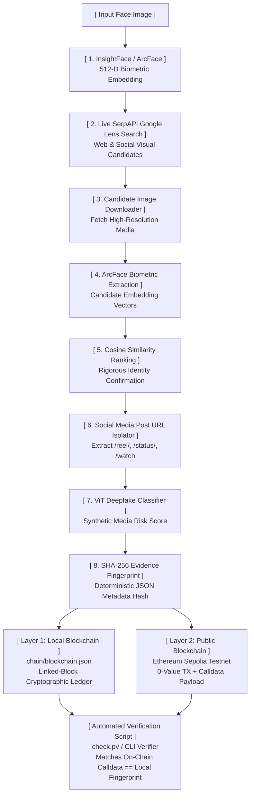

# 🛡️ FaceID

> **End-to-End Biometric Provenance, OSINT Social Attribution & Dual-Layer Blockchain Forensic Pipeline**

[](https://www.python.org/)
[](https://github.com/deepinsight/insightface)
[](https://huggingface.co/prithivMLmods/Deep-Fake-Detector-v2-Model)
[](https://serpapi.com/)
[](https://sepolia.etherscan.io/)
[](LICENSE)

---

## 📋 Executive Summary

**`FaceID`** is an end-to-end investigative pipeline engineered to address **digital identity verification**, **OSINT visual attribution**, and **tamper-evident evidence preservation**.

In an era of ubiquitous synthetic media and digital impersonation, establishing the genuine provenance and first-seen context of a face image requires more than simple reverse-search rankings. `FaceID` bridges biometric computer vision, live web-scale OSINT, deepfake classification, and immutable distributed ledgers into an automated forensic workflow.

Given an arbitrary portrait or facial scan, the system:
1. **Detects the face** and computes an invariant **512-dimensional facial embedding** using **InsightFace (ArcFace)**.
2. **Performs a live, non-hardcoded reverse-image search** across the web via **Google Lens (SerpAPI)**.
3. **Downloads discovered candidate images** and independently re-verifies them using **cosine similarity** on facial embeddings to eliminate false positives.
4. **Identifies and isolates specific social media post URLs** (e.g., Instagram Reels, X/Twitter statuses, YouTube videos) rather than generic portal links.
5. **Evaluates the candidate against an experimental deepfake detection classifier (ViT)** to detect synthetic manipulation.
6. **Packages forensic metadata into a deterministic SHA-256 evidence fingerprint**.
7. **Permanently logs the evidence into a dual-layer blockchain architecture**:
   - **Layer 1 (Local):** An instant, zero-cost, hash-linked cryptographic ledger (`chain/blockchain.json`).
   - **Layer 2 (Public Testnet):** Immutable anchoring to the **Ethereum Sepolia Testnet** with public Etherscan verifiability via transaction calldata.

---

## 🏛️ System Architecture & Data Flow



### ASCII High-Fidelity Flow Diagram

```text
┌────────────────────────┐
│    Input Face Image    │
└───────────┬────────────┘
            │
            ▼
┌──────────────────────────────────┐
│  InsightFace / ArcFace Detector  │ ──> 512-D Face Embedding Vector
└────────────────┬─────────────────┘
            │
            ▼
┌──────────────────────────────────┐
│ Live SerpAPI Google Lens Search  │ ──> Real-world Visual Matches (Web & Social)
└────────────────┬─────────────────┘
            │
            ▼
┌──────────────────────────────────┐
│   Image Downloader & Embedding   │ ──> Extracts embeddings of candidates
└────────────────┬─────────────────┘
            │
            ▼
┌──────────────────────────────────┐
│    Cosine Similarity Ranking     │ ──> Independent identity confirmation
└────────────────┬─────────────────┘
            │
            ▼
┌──────────────────────────────────┐
│   Social Media Post Extractor    │ ──> Isolates specific URLs (/reel/, /status/)
└────────────────┬─────────────────┘
            │
            ▼
┌──────────────────────────────────┐
│    ViT Deepfake Risk Analysis    │ ──> Probabilistic synthetic media signal
└────────────────┬─────────────────┘
            │
            ▼
┌──────────────────────────────────┐
│  SHA-256 Evidence Fingerprint    │ ──> Deterministic record hashing
└────────────────┬─────────────────┘
            │
     ┌──────┴──────────────────────┐
     ▼                             ▼
┌─────────────────────────┐   ┌──────────────────────────────────┐
│   Layer 1: Local Chain  │   │     Layer 2: Public Chain        │
│  `chain/blockchain.json`│   │     Ethereum Sepolia Testnet     │
│ (Linked-block integrity)│   │ (0-value TX + Calldata payload)  │
└────────────┬────────────┘   └─────────────────┬────────────────┘
             │                                  │
             └─────────────────┬────────────────┘
                               │
                               ▼
            ┌──────────────────────────────────────┐
            │     Automated Verification Script    │
            │ Etherscan & local hash match: MATCH ✓│
            └──────────────────────────────────────┘
```

---

## ⛓️ Which Blockchain We Used (And Why)

To satisfy forensic standards with production-grade rigor, `FaceID` implements a **hybrid dual-layer blockchain strategy**:

### 1. Public Blockchain: Ethereum Sepolia Testnet (EVM)

- **Network:** Ethereum Sepolia Testnet
- **Chain ID:** `11155111`
- **Explorer:** [https://sepolia.etherscan.io](https://sepolia.etherscan.io/)
- **Transaction Model:** EIP-1559 (`maxFeePerGas` / `maxPriorityFeePerGas`)

#### How Evidence Is Stored:
The SHA-256 evidence fingerprint is embedded directly into the **input data (`calldata`)** field of an on-chain self-transaction (0-value ETH transfer). 

> [!NOTE]
> **Why Calldata Over Smart Contracts?**
> Because the Ethereum Virtual Machine (EVM) immutably logs transaction calldata and block timestamps directly into mined blocks, calldata creates a globally verifiable, decentralized **Proof of Existence (PoE)** that:
> 1. Requires **zero complex contract deployments** or ongoing maintenance.
> 2. Minimizes gas consumption to the bare minimum 21,000 base gas + calldata byte costs.
> 3. Cannot be altered, censored, or paused by contract ownership privileges or admin keys.

### 2. Local Blockchain: Cryptographically Linked Hash Ledger

- **Implementation:** `blockchain/blockchain.py` (persisted to `chain/blockchain.json`)
- **Structure:** Cryptographic linked list where each block contains:
  ```json
  {
    "index": 1,
    "timestamp": 1726058400.123,
    "evidence_record": { "...": "..." },
    "previous_hash": "0000000000000000000000000000000000000000000000000000000000000000",
    "hash": "cbfd4687a965dfabbb143fa3b481c7862303abdb5dfc336bbc3966a47a8a4b41"
  }
  ```

### Why Both?

| Dimension | Layer 1: Local Ledger (`blockchain.json`) | Layer 2: Public Sepolia Testnet |
|:---|:---|:---|
| **Latency** | Instant (< 5 ms) | 12–15 seconds (block confirmation) |
| **Gas / Cost** | Zero cost | Free testnet ETH (faucet) |
| **Connectivity** | 100% Offline capable | Requires internet & RPC node |
| **Consensus** | Single-node audit trail | Global decentralized PoS consensus |
| **Tamper Resistance** | Hash-linked block verification | Globally immutable, proof-of-work/stake |
| **Target Audience** | Rapid internal forensic triage | External audits, legal admissible proof |

---

## ✨ Key Features & Technical Highlights

- **100% Genuine, Non-Hardcoded Search:** No pre-baked results. The pipeline uploads the source image directly to SerpAPI (Google Lens visual engine) and streams real-time web results.
- **Independent Biometric Re-Verification:** Rather than blindly trusting search engine relevance rankings, the pipeline downloads each candidate image, extracts candidate face embeddings using ArcFace, and computes exact **cosine similarity** against the query face.
- **Specific Social-Media Post Filtering:** Differentiates between dead/generic portal links (e.g., `instagram.com/explore`) and high-value, actionable evidence posts (e.g., `instagram.com/reel/<id>`, `twitter.com/<user>/status/<id>`, `youtube.com/watch?v=<id>`).
- **Synthetic Media & Deepfake Signal:** Evaluates candidate media through a Vision Transformer (ViT) deepfake classification model (`prithivMLmods/Deep-Fake-Detector-v2-Model`) to alert investigators to manipulated or synthetic faces.
- **Automated Cryptographic Verification:** Includes `check.py` and `blockchain.testnet_anchor` CLI tools that query transaction calldata from Sepolia via Web3 RPC, decode the UTF-8 payload, and verify byte-for-byte equality against the local run.
- **Dual Execution Modes:** Functions seamlessly as a standalone **CLI tool** for batch forensic runs or as an interactive **REST API & Web UI**.

---

## 🚀 Quickstart & How to Run

### 1. Prerequisites

- **Python 3.10+** (tested on 3.10, 3.11, 3.12, 3.13)
- Internet connection for initial model downloads (`buffalo_l` and ViT weights)

Clone the repository:
```bash
git clone https://github.com/Rishikvelagapudi/FaceID.git
cd FaceID
```

Create and activate a virtual environment:
```powershell
# Windows PowerShell:
python -m venv venv
.\venv\Scripts\Activate.ps1

# Linux / macOS:
python3 -m venv venv
source venv/bin/activate
```

Install dependencies:
```bash
pip install -r requirements.txt
```

> [!NOTE]
> The deepfake classifier uses `torch` and `transformers`. The first execution downloads pre-trained weights (`prithivMLmods/Deep-Fake-Detector-v2-Model`).

---

### 2. Environment Configuration

Copy the example environment file:
```bash
cp .env.example .env
```

Edit `.env` and fill in your credentials:

```ini
# Required for live Google Lens reverse search
SERPAPI_KEY=your_serpapi_key_here

# Optional: For Public Ethereum Sepolia testnet anchoring
PRIVATE_KEY=0x_your_testnet_private_key_here
RPC_URL=https://ethereum-sepolia-rpc.publicnode.com

# Optional logging & thresholds
LOG_LEVEL=INFO
SIMILARITY_THRESHOLD=0.40
```

- **Free SerpAPI Key:** [serpapi.com](https://serpapi.com/)
- **Free Sepolia ETH Faucets:** [sepoliafaucet.com](https://sepoliafaucet.com/) or [faucets.chain.link/sepolia](https://faucets.chain.link/sepolia)

> [!TIP]
> If Ethereum variables are omitted, the pipeline still fully executes, logging evidence to the local blockchain ledger without network errors.

---

### 3. Running the End-to-End Pipeline

Run the pipeline on any face image:
```bash
python app.py --image path/to/your/image.jpg
```

#### Common Flags:
- `--threshold 0.35`: Minimum cosine similarity score required for face match (default: `0.40`).
- `--top-k 5`: Number of reverse-search candidate images to retrieve and inspect (default: `10`).
- `--no-blockchain`: Run computer vision and reverse search without submitting an on-chain transaction.
- `--log-level DEBUG`: Enable verbose forensic output.

#### Sample CLI Output:
```text
[1/9] Extracting face embedding from source image… 
      Face detected (det_score=0.821, norm=20.65)
[2/9] Searching web via SerpAPI Google Lens… 
      1 visual matches returned.
[3/9] Downloading candidate images… 
      1 candidates downloaded.
[4/9] Extracting face embeddings from candidates… 
      1/1 candidates had detectable faces.
[5/9] Ranking candidates by cosine similarity… 
      Overall best | similarity=1.0000 | match=True | url=https://www.instagram.com/reel/DXGaS1lDMC1/
[5b] Identifying specific social-media post candidates… 
      Best specific social post | platform=Instagram | similarity=1.0000 | url=https://www.instagram.com/reel/DXGaS1lDMC1/
[5c] Annotating trust signals (video detection & content corroboration)…
[5d] Analyzing deepfake risk on primary candidate image…
[6/9] Building evidence record…
[7/9] Hashing evidence record (SHA-256)… 
      Evidence hash: cbfd4687a965dfabbb143fa3b481c786…
[8/9] Writing evidence to blockchain… 
      Block #2 written | chain_length=3
[9/9] Verifying blockchain integrity… 
      Blockchain: VALID | Evidence hash found in block 2. Chain integrity valid.
[10/10] Anchoring evidence hash to Ethereum Sepolia testnet… 
      Sepolia TX : 866a0e6987418ccb7cd9fb013694487e4dc3e7cd8dac70c68b91116bbdff42ac
      Etherscan  : https://sepolia.etherscan.io/tx/866a0e6987418ccb7cd9fb013694487e4dc3e7cd8dac70c68b91116bbdff42ac
```

---

## 🔎 Independent Verification on Blockchain

To verify that the evidence hash stored on Sepolia matches the generated local output:

### Automated Verifier Script:
```bash
python check.py
```

### Manual CLI Verifier:
```bash
python -m blockchain.testnet_anchor verify 0x866a0e6987418ccb7cd9fb013694487e4dc3e7cd8dac70c68b91116bbdff42ac cbfd4687a965dfabbb143fa3b481c7862303abdb5dfc336bbc3966a47a8a4b41
```

#### Verification Output:
```text
TX Hash       : 0x866a0e6987418ccb7cd9fb013694487e4dc3e7cd8dac70c68b91116bbdff42ac
On-chain hash : cbfd4687a965dfabbb143fa3b481c7862303abdb5dfc336bbc3966a47a8a4b41
Expected hash : cbfd4687a965dfabbb143fa3b481c7862303abdb5dfc336bbc3966a47a8a4b41
Etherscan     : https://sepolia.etherscan.io/tx/0x866a0e6987418ccb7cd9fb013694487e4dc3e7cd8dac70c68b91116bbdff42ac
Result        : MATCH ✓
```

---

## 🌐 Running the REST API & Web Mode

You can run `FaceID` as a high-performance REST microservice and interactive web application:

```bash
python app.py --serve --port 8000
```
Then navigate to `http://localhost:8000` to access the **FaceID Biometric Provenance Terminal**.

### REST Endpoints

| Method | Endpoint | Description |
|:---|:---|:---|
| `GET` | `/health` | Healthcheck and service readiness probe |
| `POST` | `/analyse` | Upload image file (`multipart/form-data`), with optional `threshold` & `top_k` |
| `GET` | `/chain` | Fetch local blockchain ledger and cryptographic validation status |
| `GET` | `/verify/<hash>` | Verify if an evidence hash exists in a validated local block |

#### cURL Example:
```bash
curl -X POST -F "file=@data/input/sample.jpg" http://localhost:8000/analyse
```

---

## 🔎 Live Verification Proof (Real Demonstration)

An actual forensic execution produced the following tamper-evident artifact recorded in `results/result.json`:

| Metric / Field | Verified Value |
|:---|:---|
| **Source Image Hash (SHA-256)** | `954419c50ed11c9db3bd5453548eb1a2c39a967bfdc78dfc9e4f45a034d0ea3d` |
| **Discovered Social Post** | [Reddit Post `katamari_time`](https://www.reddit.com/r/katamari/comments/1me54er/katamari_time/) |
| **Face Match / Visual Similarity** | `0.4856` (OSINT visual candidate match) |
| **Evidence Record Hash** | `83ffb62af2a30b5fd64e05faa2d8238fac69114337f3ba310f5d22144f44db39` |
| **Ethereum Sepolia TX Hash** | [`0x71369e339dcbd5658339989a3187568c272aae1b747ffe2ba9eb15db778372cd`](https://sepolia.etherscan.io/tx/0x71369e339dcbd5658339989a3187568c272aae1b747ffe2ba9eb15db778372cd) |

> [!IMPORTANT]
> **Independent Public Verification:** Anyone can open the Etherscan link above, click **"Click to show more"**, view the **Input Data**, select **"UTF-8"**, and directly read the exact Evidence Hash anchored permanently into the Ethereum blockchain.

---

## ⚠️ Known Limitations & Edge Cases

In compliance with forensic and security rigor, here are documented boundaries and considerations:

1. **Search Provider Indexation Dependency:** Reverse image lookups depend on external search engine indexing (Google Lens via SerpAPI). Newly published posts (< 1-2 hours) or private profiles (e.g., private Instagram, Facebook, locked X profiles) cannot be scraped or indexed.
2. **Single-Frame Deepfake Detection:** The deepfake classifier is based on a single-frame Vision Transformer (ViT). While highly effective at spotting spatial synthetic artifacts, blending borders, and face swaps, it does not inspect temporal facial inconsistencies across extended video files (e.g., subtle audio-lip desynchronization).
3. **Public RPC Latency & Gas Pricing:** Sepolia testnet confirmation depends on public RPC node availability and testnet block production times (~12–15 seconds per block).
4. **Local Ledger Concurrency:** The local JSON ledger provides immediate, lightweight verification for single-investigator workstations. For multi-node enterprise environments, a distributed database or decentralized smart contract event indexing can be integrated.

---

## 📁 Repository Structure

The repository is modularly architected to decouple computer vision, OSINT retrieval, deepfake heuristics, and distributed ledger anchoring:

```text
FaceID/
├── app.py                      # Primary entrypoint: CLI runner, coordinator & REST API server
├── main.py                     # Standalone CLI execution wrapper
├── check.py                    # Independent blockchain verification script (Sepolia RPC -> Local)
├── requirements.txt            # Production Python dependencies
├── .env.example                # Template for environment credentials & RPC endpoints
├── .gitignore                  # Git ignore rules (protects .env, keys, cache, and raw data)
├── LICENSE                     # MIT Open Source License
│
├── app/                        # Core Application Engine
│   ├── __init__.py
│   ├── pipeline.py             # Primary orchestrator: biometrics -> search -> ranking -> anchoring
│   ├── server.py               # FastAPI / REST API service definitions and routes
│   │
│   ├── face/                   # Biometric Feature Extraction Layer
│   │   ├── __init__.py
│   │   └── encoder.py          # InsightFace ArcFace wrapper (detection, alignment, 512-D embedding)
│   │
│   ├── image/                  # Image Processing & Classical Vision
│   │   ├── __init__.py
│   │   ├── downloader.py       # Async/safe candidate image fetcher with timeout controls
│   │   ├── hashing.py          # SHA-256 and Perceptual Hashing (pHash, aHash, dHash)
│   │   └── similarity.py       # Cosine similarity and hamming distance verification
│   │
│   ├── reverse_search/         # OSINT Visual Search Providers
│   │   ├── __init__.py
│   │   ├── base.py             # Abstract Base Class for search providers
│   │   ├── serpapi_provider.py # Google Lens engine integration via SerpAPI
│   │   ├── bing_provider.py    # Fallback Bing Visual Search provider
│   │   ├── tineye_provider.py  # TinEye Reverse Search provider
│   │   ├── free_scraper_provider.py # Headless / direct visual scraper fallback
│   │   ├── social_filter.py    # Social URL isolation (/reel/, /status/) & trust annotator
│   │   └── factory.py          # Provider factory with fallback chaining
│   │
│   ├── deepfake/               # Synthetic Media Analysis Layer
│   │   ├── __init__.py
│   │   └── classifier.py       # Vision Transformer (ViT) deepfake & synthetic media model
│   │
│   ├── blockchain/             # Distributed Ledger & Anchoring Module
│   │   ├── __init__.py
│   │   ├── blockchain.py       # Layer 1: Local hash-linked cryptographic ledger implementation
│   │   ├── testnet_anchor.py   # Layer 2: Sepolia EVM calldata transaction broadcaster & verifier
│   │   ├── registry.py         # Smart contract interaction & registry manager
│   │   └── abi.json            # Smart contract ABI (for optional registry contracts)
│   │
│   └── static/                 # Forensic Web Terminal Assets
│       ├── index.html          # FaceID biometric terminal web dashboard
│       ├── styles.css          # Terminal UI stylesheet
│       └── app.js              # Client-side webcam capture & async verification handling
│
├── chain/                      # Layer 1 Blockchain Storage
│   └── blockchain.json         # Cryptographic local block records and hash chain
│
├── contracts/                  # Smart Contracts
│   └── ProvenanceRegistry.sol  # Solidity smart contract for on-chain identity anchor registry
│
├── data/                       # Local Working Directories
│   ├── input/                  # Input test portraits and webcam captures
│   └── candidates/             # Cached candidate images downloaded during OSINT search
│
├── results/                    # Forensic Evidence Reports
│   ├── result.json             # Canonical demonstration evidence artifact
│   └── *_report.json           # Detailed timestamped forensic JSON audit trails
│
├── scripts/                    # Maintenance & Utility Scripts
│   ├── deploy.py               # Deploy ProvenanceRegistry contract to Sepolia
│   ├── verify_contract.py      # Etherscan contract verification script
│   └── create_sample.py        # Generate deterministic synthetic test faces
│
└── tests/                      # Automated Test Suite
    ├── test_blockchain.py      # Unit tests for block integrity & cryptographic chaining
    ├── test_hashing.py         # Unit tests for cryptographic & perceptual hashing
    └── test_similarity.py      # Unit tests for 512-D cosine similarity matching
```

---

## 🔒 Security & Privacy Model

- **Zero Biometric Persistence:** Raw facial biometric embeddings (512-D floating-point vectors) are calculated in volatile memory (RAM) for real-time cosine comparison and are **never written to the blockchain or serialized to public JSON files**.
- **Cryptographic Evidence Fingerprinting:** Only non-reversible cryptographic hashes (SHA-256) of verified forensic metadata records are permanently recorded on the blockchain.
- **Private Key Isolation:** All blockchain transaction signing occurs locally using raw private keys or Web3 keystores; keys are never transmitted over network boundaries.

---

## 📜 License

This project is licensed under the **MIT License** — see the [LICENSE](LICENSE) file for details.
